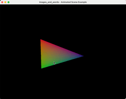

# images_and_words

GPU middleware and abstraction layer for high-performance graphics applications and games.

images_and_words provides a practical middle ground between low-level GPU APIs and full game engines,
offering higher-order GPU resource types optimized for common patterns while maintaining the flexibility
to bring your own physics, sound, and game logic.


# Demo



## Live browser demos

[Demo showcase](https://iwdemo.sealedabstract.com/)

The examples are cross-compiled to WebAssembly and run in the browser.

# The Pitch

Suppose you want to write a game or graphics application. You may consider:

* **Game engines** (Unity, Unreal, Godot) - But these might be much more than you need,
  be difficult to customize, have vendor lock-in, or make optimization challenging.
* **Low-level APIs** (Vulkan, Metal, DirectX) - But these are complex, verbose, and require
  solving many already-solved problems, plus multiplatform support is difficult.

Wouldn't it be nice to have a middle ground? Here's how images_and_words compares:

| Strategy            | Examples             | API style   | API concepts                                                      | Synchronization concerns | Shaders                                 | Runtime size | Platform support                         | Development speed | Runtime speed                               |
|---------------------|----------------------|-------------|--------------------------------------------------------------------|--------------------------|------------------------------------------|--------------|-------------------------------------------|-------------------|-----------------------------------------------|
| Game engine         | Unity, Unreal, Godot | Scene-based | Scene, nodes, camera, materials                                     | Low                      | Mostly built-in; programmability varies  | Massive      | Excellent                                 | Very high         | Depends on how similar you are to optimized use cases |
| Low-level APIs      | DX, Vulkan, Metal    | Pass-based  | Passes, shaders, buffers, textures                                  | High                     | BYO, extremely customizable              | None         | Poor; write once, run once                | Very low          | Extreme                                        |
| Layered implementations | MoltenVK, Proton, wgpu | Pass-based  | Passes, shaders, buffers, textures                                  | High                     | BYO, customizable in theory; translation causes issues | Some         | Good in theory; varies in practice        | Very low          | Excellent on native platforms; varies on translated platforms |
| Constructed APIs    | WebGPU               | Pass-based  | Passes, shaders, buffers, textures                                  | Medium-high              | BYO, customizable, though many features stuck in committee | It's complicated | Some browser support, some translation support | Medium-low      | Good                                          |
| GPU middleware      | images_and_words     | Pass-based  | Passes, shaders, camera, higher-order buffers and textures, multibuffering, common patterns | Medium-low              | BYO, inherit from backends               | Some         | Good in theory; varies in practice        | Medium            | Good                                          |

GPU middleware occupies a unique and overlooked niche in the ecosystem.  It provides a
cross-platform abstraction over GPU hardware, while also allowing you to bring your own
sound, physics, accessibility, and your entire existing codebase to the table.  These are the main
advantages of the middleware category as a whole.

Beyond the pros and cons of GPU middleware as a category, images_and_words is specifically the dream GPU API I
wanted in a career as a high-performance graphics application developer.  Often, the motivation for
GPU acceleration is we have some existing CPU code that we think is too slow, and we consider
some ways to improve it including GPU acceleration, but that might take a week to prototype on
one platform.  The major #1 goal of IW is to prototytpe GPU acceleration on various platforms
in a day or two at most.

A second major design goal is that eventually, you are likely to hit a second performance wall.
It should be easy to reason about the performance of IW applications, and to optimize
its primitives to meet your needs.  IW is designed to be a practical and performant target for my
own career of applications, and I hope it can be for yours as well.

# Core Concepts

## Higher-Order Memory Types

The main innovation of images_and_words is providing a family of higher-order buffer and texture types.
These types are layered atop traditional GPU resources but are optimized for specific use cases,
with built-in multibuffering and synchronization to prevent pipeline stalls.

## The Three-Axis Type System

images_and_words organizes GPU resources along three orthogonal axes, allowing you to select
the precise abstraction for your use case:

### Axis 1: Resource Type (Buffer vs Texture)

**Buffers** provide:
- Arbitrary memory layouts with full programmer control
- Support for any type implementing the `CRepr` trait
- Direct indexed access patterns
- Flexible size constraints
- Use cases: vertex data, uniform blocks, compute storage

```rust
use images_and_words::{
    images::Engine,
    bindings::{forward::r#static::buffer::Buffer, visible_to::GPUBufferUsage},
};

// Any C-compatible struct can be stored in a buffer
#[repr(C)]
struct MyData {
    value: f32,
    flags: u32,
}
unsafe impl images_and_words::bindings::forward::dynamic::buffer::CRepr for MyData {}

let engine = Engine::for_testing().await.unwrap();
let device = engine.bound_device();

let buffer = Buffer::new(
    device.clone(),
    1,
    GPUBufferUsage::FragmentShaderRead,
    "my_data",
    |_| MyData { value: 1.0, flags: 0 }
).await.unwrap();
```

**Textures** provide:
- GPU-optimized storage for image data
- Hardware-accelerated sampling and filtering
- Fixed pixel formats (`RGBA8UnormSRGB`, etc.)
- Spatial access patterns optimized for 2D/3D locality
- Use cases: images, render targets, lookup tables

```rust
use images_and_words::{
    bindings::software::texture,
    pixel_formats::{RGBA8UnormSRGB, RGBA8UnormSRGBPixel},
};

// Create a software texture (no GPU required for this example)
let sw_texture = texture::Texture::<RGBA8UnormSRGB>::new(4, 4, RGBA8UnormSRGBPixel::default());

// Software texture is ready to use or upload to GPU
assert_eq!(sw_texture.width(), 4);
assert_eq!(sw_texture.height(), 4);
```

### Axis 2: Mutability (Static vs Dynamic)

**Static** resources:
- Immutable after creation
- Optimized for many GPU reads per CPU upload
- Placed in GPU-only memory when possible
- Zero synchronization overhead
- Examples: mesh geometry, texture atlases

**Dynamic** resources:
- Mutable throughout lifetime
- Optimized for frequent CPU updates
- Automatic multibuffering to prevent stalls
- Transparent synchronization
- Examples: per-frame uniforms, streaming data

### Axis 3: Direction (Data Flow Patterns)

| Direction | Flow | Use Cases | Status |
|-----------|------|-----------|---------|
| **Forward** | CPU→GPU | Rendering data, textures, uniforms | ✅ Implemented |
| **Reverse** | GPU→CPU | Screenshots, compute results, queries | ⏳ Planned |
| **Sideways** | GPU→GPU | Render-to-texture, compute chains | ⏳ Planned |
| **Omnidirectional** | CPU↔GPU | Interactive simulations, feedback | ⏳ Planned |

## Choosing the Right Type

To select the appropriate binding type:

1. **Identify data flow**: Where does data originate and where is it consumed?
2. **Determine update frequency**: Does it change every frame or remain constant?
3. **Consider access patterns**: Do you need shader sampling or structured access?

### Quick Decision Guide

| Your Use Case | Recommended Type |
|---------------|------------------|
| Mesh geometry that never changes | `bindings::forward::static::Buffer` |
| Textures loaded from disk | `bindings::forward::static::Texture` |
| Camera matrices updated per frame | `bindings::forward::dynamic::Buffer` |
| Render-to-texture targets | `bindings::forward::dynamic::FrameTexture` |
| Particle positions (CPU generated) | `bindings::forward::dynamic::Buffer` |
| Lookup tables for shaders | `bindings::forward::static::Buffer` or `Texture` |

## Implementation Status

Currently implemented:
- Forward Static Buffer ✅
- Forward Static Texture ✅
- Forward Dynamic Buffer ✅
- Forward Dynamic FrameTexture ✅

Examples include:

| Class    | Use case       | Potential optimizations                 | Multibuffering | Synchronization      |
|----------|----------------|-----------------------------------------|----------------|----------------------|
| Static   | Sprites, etc   | Convert to a private, GPU-native format | Not needed     | Not needed           |
| Forward  | Write CPU->GPU | Unified vs discrete memory              | Builtin        | Builtin              |
| Reverse  | Write GPU->CPU | Unified vs discrete memory              | Builtin        | Builtin              |
| Sideways | Write GPU->GPU | private, GPU-native format              | Builtin        | TBD                  |

# Architecture

## Backend System

images_and_words uses a backend abstraction that allows different GPU API implementations.
Currently, two backends are available:

- **`nop` backend**: A no-operation stub implementation useful for testing and as a template for new backends
- **`wgpu` backend**: The main production backend built on [wgpu](https://wgpu.rs), providing broad platform support

```rust
// The backend is selected at compile time via features
// Enable wgpu backend in Cargo.toml:
// [dependencies]
// images_and_words = { version = "*", features = ["backend_wgpu"] }
```

The wgpu backend inherits support for:
- **Native APIs**: Direct3D 12, Vulkan, Metal
- **Web APIs**: WebGPU, WebGL2 (via ANGLE)
- **Platforms**: Windows, macOS, Linux, iOS, Android, WebAssembly

## Key Modules

The codebase is organized into several key modules:

### Core Rendering (`images`)
Provides the main rendering infrastructure:
- `Engine`: Main entry point for GPU operations
- `render_pass`: Render pass configuration and draw commands
- `shader`: Vertex and fragment shader management
- `view`: Display surface abstraction
- `port`: Viewport and camera management
- `projection`: Coordinate systems and transformations

### Resource Bindings (`bindings`)
Higher-order GPU resource types:
- `forward`: CPU→GPU data transfer types
  - `static`: Immutable resources
  - `dynamic`: Mutable resources with multibuffering
- `software`: CPU-side texture operations
- `sampler`: Texture sampling configuration

### Pixel Formats (`pixel_formats`)
Type-safe pixel format definitions:
- Strong typing for different color spaces and formats
- Compile-time format validation
- Automatic conversion handling

## Backend Philosophy

I have intentionally designed images_and_words to support multiple backends. Currently the crate
uses wgpu for its broad platform support.  However I also have direct Vulkan and Metal backends in
various stages of development.

Ultimately my goals are:

* Focus and optimize for hardware/software that is relevant to in-development applications and games
* Do something that technically works in weird environments like CI or minority platforms
* Ship a long-term, broad-strokes API design that can be preserved beyond any one backend
  implementation

Currently this translates into these tiers:

1.  🚀 Windows 10+ (DX12, Vulkan 1.3+)
2.  🎮 recent Linux (DX12/proton, Vulkan 1.3+)
3.  🎮 recent macOS (Metal, MoltenVK 1.3+)
4.  🆗 WebGPU (Chrome 141+, Safari 26.0+, Firefox 142 on Windows)
5.  💥 WebGL2 (Firefox non-Windows, Safari 18.x, etc)
6.  💥 Other wgpu GL (GL 3, GL ES 3, etc.)

Legend:
* 🚀 - first-class support, practically every issue you can hit even at all is a good candidate to file
* 🎮 - good support, fairly well-tested, your issues encounter rarer bugs but still good intel
* 🆗 - the API is designed to this baseline.  Correctness issues are definitely bugs, performance
  issues likely require escape hatches not supported by the API per se.
* 💥 - Below the design baseline.  It is intended that this works for a limited subset of APIs and
  will panic if not supported, but also this is going to bitrot as time goes on.

### A note on WebGL2

For the time being, we need to support this in demos and the `wgpu_webgl` feature because:

* iOS 18.x (13% global marketshare)
* Firefox 141+ (<1% global marketshare)

But you should expect this backend to be cut because:

* It bloats the WASM size by a many multiples (5x)
* Many planned features cannot work inside WebGL2 constraints
* the wgpu backend is poor in this mode and I have no plans to improve it
* most of the implementations at this point are translation layers that mostly replicate
  what published games do

# Getting Started

## Basic Setup

Create a rendering engine and access the main rendering port:

```rust
use images_and_words::images::Engine;

// Create a rendering engine for testing
let engine = Engine::for_testing().await
    .expect("Failed to create engine");

// Access the main rendering port
let mut port = engine.main_port_mut();
// Port is now ready for rendering operations
```

## Working with Buffers

```rust
use images_and_words::{
    images::Engine,
    bindings::{forward::r#static::buffer::Buffer, visible_to::GPUBufferUsage},
};

// Define a vertex type with C-compatible layout
#[repr(C)]
#[derive(Copy, Clone, Debug)]
struct Vertex {
    position: [f32; 3],
    color: [f32; 4],
}
unsafe impl images_and_words::bindings::forward::dynamic::buffer::CRepr for Vertex {}

let engine = Engine::for_testing().await.unwrap();
let device = engine.bound_device();

// Create a static buffer with 3 vertices
let vertex_buffer = Buffer::new(
    device.clone(),
    3,  // count of vertices
    GPUBufferUsage::VertexBuffer,
    "triangle_vertices",
    |index| match index {
        0 => Vertex { position: [-0.5, -0.5, 0.0], color: [1.0, 0.0, 0.0, 1.0] },
        1 => Vertex { position: [ 0.5, -0.5, 0.0], color: [0.0, 1.0, 0.0, 1.0] },
        2 => Vertex { position: [ 0.0,  0.5, 0.0], color: [0.0, 0.0, 1.0, 1.0] },
        _ => unreachable!()
    }
).await.expect("Failed to create buffer");
```

## Working with Dynamic Resources

```rust
use images_and_words::{
    bindings::{forward::dynamic::buffer, visible_to::GPUBufferUsage},
};

// Define a uniform data structure
#[repr(C)]
struct UniformData {
    time: f32,
    _padding: [f32; 3],
}
unsafe impl buffer::CRepr for UniformData {}

// Dynamic buffers support automatic multibuffering
// to prevent GPU pipeline stalls when updating data
let uniform_data = UniformData {
    time: 1.0,
    _padding: [0.0; 3]
};

// This would create a buffer when GPU is available:
// let buffer = Buffer::new(device, 1, GPUBufferUsage::FragmentShaderRead,
//                         "uniforms", |_| uniform_data).await?;
```

# Examples

## Complete Rendering Pipeline

```rust
use images_and_words::{
    images::{Engine, projection::WorldCoord, view::View},
    bindings::{forward::r#static::buffer::Buffer, visible_to::GPUBufferUsage},
};

// Create engine with camera position
let engine = Engine::rendering_to(
    View::for_testing(),
    WorldCoord::new(0.0, 0.0, 5.0)
).await.expect("Failed to create engine");

let device = engine.bound_device();

// Define vertex data
#[repr(C)]
struct Vertex {
    position: [f32; 3],
}
unsafe impl images_and_words::bindings::forward::dynamic::buffer::CRepr for Vertex {}

// Create GPU buffer with vertex data
let vertex_buffer = Buffer::new(
    device.clone(),
    3,
    GPUBufferUsage::VertexBuffer,
    "triangle",
    |index| match index {
        0 => Vertex { position: [-1.0, -1.0, 0.0] },
        1 => Vertex { position: [ 1.0, -1.0, 0.0] },
        2 => Vertex { position: [ 0.0,  1.0, 0.0] },
        _ => unreachable!()
    }
).await.expect("Failed to create vertex buffer");

// Access the rendering port
let mut port = engine.main_port_mut();
// Ready to issue draw commands
```

# Performance Considerations

## Multibuffering

Dynamic resources automatically use multibuffering to prevent GPU pipeline stalls:

```rust
use images_and_words::bindings::forward::dynamic::buffer;

// Dynamic buffers automatically manage multiple backing buffers
// to prevent CPU-GPU synchronization stalls

#[repr(C)]
struct FrameData {
    time: f32,
    _pad: [f32; 3]
}
unsafe impl buffer::CRepr for FrameData {}

// Multibuffering concept:
// - Frame 1: CPU writes to buffer A, GPU reads buffer B
// - Frame 2: CPU writes to buffer B, GPU reads buffer A
// - CPU never blocks waiting for GPU to finish

let frame_data = FrameData { time: 1.0, _pad: [0.0; 3] };

// Buffer would be created with:
// Buffer::new(device, count, usage, name, |_| frame_data).await
```

## Memory Placement

Static resources are automatically placed in optimal GPU memory when possible,
while dynamic resources use accessible memory for frequent updates.

# Thread Safety and Async

This project uses custom async executors (not tokio):
- `test_executors` for test code
- `some_executor` for production code

Graphics operations typically require main thread execution, especially on platforms like macOS.

# Contributions

If you are motivated enough to consider writing your own solution, I would love to have your help
here instead.

# Development Commands

## macOS-specific requirements
On macOS, set the deployment target: `export MACOSX_DEPLOYMENT_TARGET=15`

## Building
**Build:** `cargo build --features=backend_wgpu`

**Build with app window support:** `cargo build --features=backend_wgpu,app_window`

**Build for WASM:** `./build/wasm_example.sh simple_scene`

## Testing
**Run all tests:** `cargo test --features=backend_wgpu,testing`

**Run single test:** `cargo test --features=backend_wgpu,testing test_name`

**Run specific test file:**
* `cargo test --features=backend_wgpu,testing --test buffer_performance`
* `cargo test --features=backend_wgpu,testing --test sendable_futures`
* `cargo test --features=backend_wgpu,testing --test texture_alignment`
* `cargo test --features=backend_wgpu,testing --test wgpu_cell_threading_error`

## Linting and Validation
**Run clippy:** `cargo clippy --features=backend_wgpu`

**Format check:** `cargo fmt --check`

**Quick check script (runs all validations):** `./quickcheck.sh`

## Documentation
**Build and open docs:** `cargo doc --features=backend_wgpu --no-deps --open`

## Examples
**Run simple scene:** `cargo run --example simple_scene --features=backend_wgpu,app_window`

**Run animated scene:** `cargo run --example animated_scene --features=backend_wgpu,app_window`

# Feature Flags

* `backend_wgpu` - Enables the wgpu GPU backend (required for most development)
* `app_window` - Enables window surface creation for applications
* `testing` - Enables testing utilities
* `wgpu_webgl` - Enables WebGL backend for wgpu (for web targets)
* `logwise_internal` - Internal logging features

# WASM/WebAssembly Support

The project supports WebAssembly targets with special configuration:
* Uses `wasm32-unknown-unknown` target
* Requires nightly Rust for atomics support
* Build with: `./build/wasm_example.sh [example_name]`
* Cargo config enables atomics: `-C target-feature=+atomics`

# Logging

Uses `logwise` for logging. Example syntax:
```rust
logwise::info_sync!("Here is foo: {foo}", foo=3);
```

Complex types require coercion through `logwise::privacy`:
```rust
logwise::warn_sync!("Here is foo: {foo}", foo=logwise::privacy::LogIt(example));
```